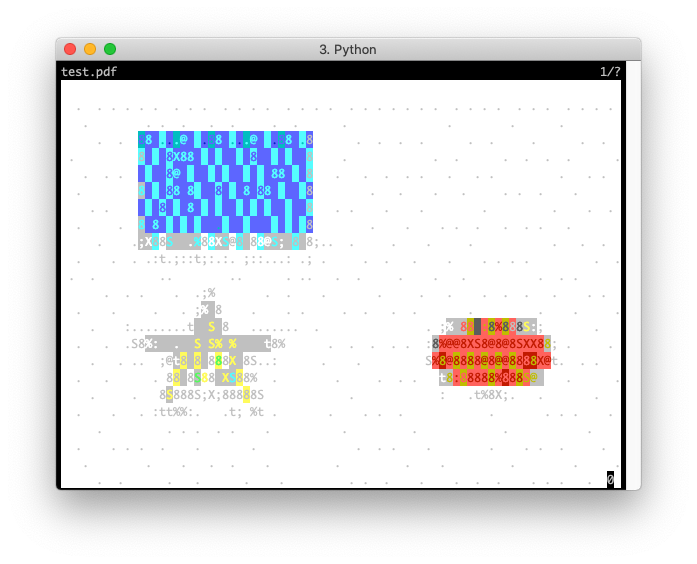

# pdftty

[](https://pypi.python.org/pypi/pdftty)

A PDF viewer for the terminal.

ANSI renderer                              |  CACA renderer
:-----------------------------------------:|:-------------------------:
  |  


## Installation

```bash
$ pip install pdftty
```

Make sure to also install [libcaca](https://github.com/cacalabs/libcaca) if you want to use the `CACA` rendering engine.


## Usage

```bash
$ pdftty --help
Usage: pdftty [OPTIONS] <file>

  View PDFs in the terminal.

Options:
  --page INTEGER               Page of PDF to open.
  --render-engine [ANSI|CACA]  Which engine to use to render PDF page as text.
  --help                       Show this message and exit.
```
